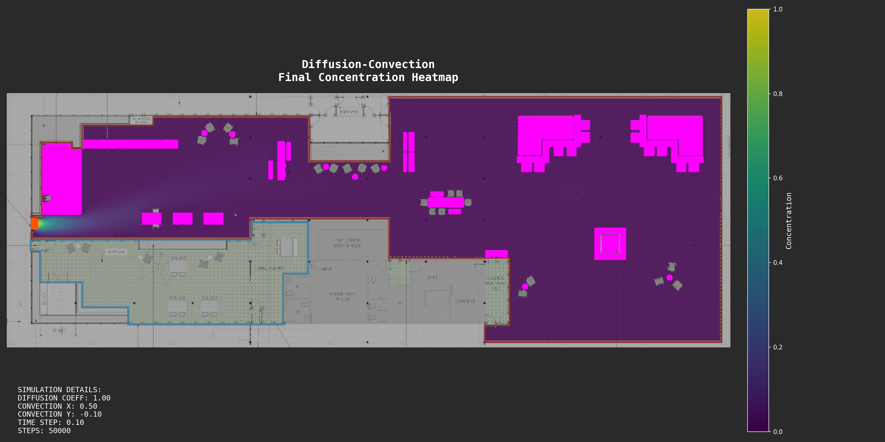
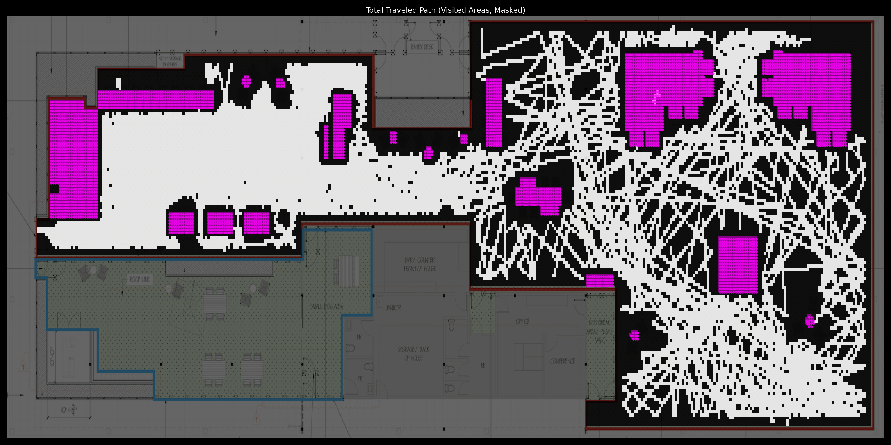

# Dog Park Layout Simulator

## Project Overview

This project aims to understand and optimize dog park space utilization through computational modeling of foot traffic patterns. By simulating how dogs and their owners might navigate through a proposed dog park layout, we can identify potential congestion points, underutilized areas, and optimize the placement of features and obstacles.

## Simulation Methods

The project implements two complementary simulation approaches to model movement and space utilization:

### 1. Flocking Simulation (BOIDS)

The flocking simulation utilizes Craig Reynolds' BOIDS algorithm to model the natural group behavior of dogs in a social setting. This agent-based approach simulates individual dogs moving through the space following three primary rules:

- **Separation**: Dogs avoid crowding and colliding with each other
- **Alignment**: Dogs tend to move in the same direction as nearby dogs
- **Cohesion**: Dogs are attracted to the center of mass of nearby dogs

Additional rules handle obstacle avoidance and boundary constraints. This simulation provides a realistic representation of social animal movement patterns and emergent group behaviors.

### 2. Diffusion-Convection Simulation

The diffusion-convection simulation takes a different approach by treating foot traffic as a fluid-like phenomenon modeling the transport of solutes in a fluid:

- **Diffusion**: Models the natural spreading of movement in all directions
- **Convection**: Represents directed movement trends in specific directions

This physics-based approach treats dogs and owners as a concentration that flows through the park, spreading around obstacles and settling into a steady-state distribution over time. The simulation provides insights into overall traffic density and identifies areas of high and low utilization.

## Layout Extraction

The simulator works with blueprint images of proposed dog park layouts:

1. **Boundary Detection**: Red boundaries in the blueprint define the overall park perimeter
2. **Obstacle Identification**: 
   - White obstacles (structures, benches, etc.) are detected based on color thresholds
   - Grey obstacles (trees, posts, etc.) are identified using separate color processing
3. **Traversable Space**: Areas inside the boundaries that are not obstacles are identified as traversable space
4. **Entry Points**: The system detects park entrances for realistic simulation of arrival patterns

The `Space_Preprocessor` module handles this conversion from blueprints to simulation-ready data structures, with an interactive approval process allowing manual correction of detected features.

## Key Features

- Interactive visualization with parameter adjustment sliders
- Heatmap generation for analyzing space utilization
- Adjustable simulation parameters (diffusion coefficient, convection direction, cohesion/separation/alignment factors)
- Automatic obstacle and boundary detection from blueprints
- Support for downsampling to speed up development iterations

## Analysis

The generated heatmaps provide visual insights into:
- High-traffic areas that may experience congestion
- Underutilized spaces that might benefit from feature placement
- Flow patterns around obstacles
- Impact of entry points on overall space utilization

By comparing results from both simulation methods, designers can gain a more comprehensive understanding of how the proposed space might function in real-world scenarios.

# Example Results

Below are example heatmaps generated by the two simulation methods, visualizing space utilization in a sample dog park layout.

## Proof of Concept: Simple Rectangle Layout

The following figures are generated using a simple empty rectangular layout (no obstacles, just boundaries). This serves as a proof of concept to demonstrate the general behavior of the algorithms in an unobstructed space.

### Diffusion-Convection Heatmap (Simple Layout)


*Figure: Concentration heatmap from the diffusion-convection simulation on a simple rectangle. High values (yellow/white) indicate areas with the most expected foot traffic, while dark regions are less utilized.*

### Flocking (BOIDS) Heatmap (Simple Layout)


*Figure: Agent density heatmap from the flocking (BOIDS) simulation on a simple rectangle. Brighter areas show where simulated dogs spend the most time, revealing emergent group behaviors and congestion points.*

# Results on Proposed Dog Park Layout with Obstacles

The following figures show the results of both simulation methods on the actual proposed dog park layout, including detected obstacles and boundaries. These visualizations provide insight into how the real space will be utilized, highlighting congestion points, underutilized areas, and the impact of obstacles on movement patterns.

### Diffusion-Convection Heatmap (Proposed Layout)



*Figure: Steady-state concentration heatmap from the diffusion-convection simulation on the proposed dog park layout with obstacles.*

### Flocking (BOIDS) Heatmap (Proposed Layout)


*Figure: Agent density heatmap from the flocking (BOIDS) simulation on the proposed dog park layout with obstacles.*

### Additional Flocking Visualizations

The primary heatmap can be a bit faint making understanding the foot traffic difficult so too additonal visualizations are provided. 



*Figure: Binary map of all areas visited by agents during the flocking simulation (proposed layout).* 


*Figure: Coarse-grained, normalized density heatmap from the flocking simulation (proposed layout).* 


## Usage

You can run both simulation types in two modes:

- **Heatmap Mode (`--heatmap` flag):**
  - Runs the simulation for many steps and saves summary figures (heatmaps) to the `figures` directory.
  - Best for analyzing overall space utilization and generating results for reports or the README.
  - No animation window will appear; only images are saved.

- **Animation Mode (no `--heatmap` flag):**
  - Opens an interactive animation window showing the simulation in real time.
  - Useful for visually exploring the dynamics and adjusting parameters live.
  - Not recommended for very long simulations, as it can be slow.

### Preprocessing a Blueprint

```bash
python src/Space_Preprocessor.py path/to/blueprint.png
```

Obstacles can be deselected by clicking on them. This is often required as the object detection has some errors. 

Select Done when the space looks correct and respond yes to the following terminal prompt. 

### Running Simulations

#### Diffusion-Convection Simulation

- **To generate a heatmap (summary figure, best for long runs):**
  ```bash
  python src/diffusion_simulation.py --layout layouts/processed_space.pkl --diffusion 1.0 --convection_x 0.5 --convection_y -0.1 --dt 0.15 --steps 2000 --heatmap
  ```
  This will save the heatmap to the `figures` directory and not show an animation.

- **To view the interactive animation:**
  ```bash
  python src/diffusion_simulation.py --layout layouts/processed_space.pkl --diffusion 1.0 --convection_x 0.5 --convection_y -0.1 --dt 0.15 --steps 500
  ```
  This will open a window with a live animation of the simulation.

#### Flocking (BOIDS) Simulation

- **To generate a heatmap (summary figure, best for long runs):**
  ```bash
  python src/flocking_simulation.py --layout layouts/processed_space.pkl --steps 2000 --heatmap
  ```
  This will save the heatmap to the `figures` directory and not show an animation.

- **To view the interactive animation:**
  ```bash
  python src/flocking_simulation.py --layout layouts/processed_space.pkl --steps 500
  ```
  This will open a window with a live animation of the simulation.

